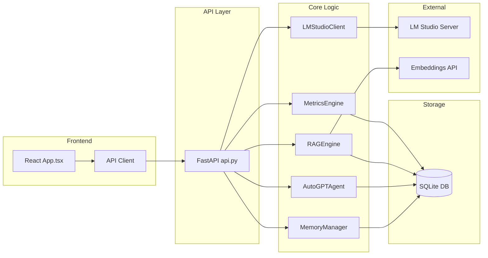

# 🗺️ PROJECT ATLAS: MAX AI Assistant

> **Дата генерации:** 2025-12-13  
> **Версия проекта:** 1.0.0  
> **Технологический стек:** Python (FastAPI + Gradio) | React + TypeScript (Vite)

---

## 1. 📂 Структура и Обязанности

### 🔧 BACKEND: `src/`

---

#### 📦 `src/core/` — Ядро системы (26 модулей)

| Файл | Роль | Ключевые классы | ⚠️ Сложность |
|------|------|-----------------|--------------|
| [lm_client.py](file:///c:/Users/Vitaliy/Desktop/MAX/src/core/lm_client.py) | **LLM Driver** — OpenAI-совместимый клиент LM Studio | `LMStudioClient`, `TaskType`, `ThinkingMode`, `ModelInfo` | 🔴 Высокая |
| [memory.py](file:///c:/Users/Vitaliy/Desktop/MAX/src/core/memory.py) | **Memory Hub** — Многоуровневая память (Session + Summary + Facts) | `MemoryManager`, `Message`, `Fact`, `Conversation` | 🔴 Высокая |
| [autogpt.py](file:///c:/Users/Vitaliy/Desktop/MAX/src/core/autogpt.py) | **Agent Logic** — Автономный агент с планированием | `AutoGPTAgent`, `AutoGPTRun`, `Step`, `Task`, `RunStatus` | 🔴 Высокая |
| [tools.py](file:///c:/Users/Vitaliy/Desktop/MAX/src/core/tools.py) | **Tool System** — Файловые операции, shell, web-поиск | `ToolExecutor`, `ToolResult`, `TOOLS`, `DANGEROUS_TOOLS` | 🔴 Высокая |
| [metrics.py](file:///c:/Users/Vitaliy/Desktop/MAX/src/core/metrics.py) | **Metrics Engine** — IQ & Empathy метрики, достижения | `MetricsEngine`, `MetricResult`, `Achievement`, `ImplicitFeedbackAnalyzer` | 🔴 Высокая |
| [rag.py](file:///c:/Users/Vitaliy/Desktop/MAX/src/core/rag.py) | **RAG Engine** — Поиск по документам (PDF, DOCX, TXT) | `RAGEngine`, `Document`, `Chunk` | 🟡 Средняя |
| [adaptation.py](file:///c:/Users/Vitaliy/Desktop/MAX/src/core/adaptation.py) | **Adaptation** — Обучение на ошибках и успехах | `CorrectionDetector`, `FeedbackMiner`, `AdaptivePromptBuilder`, `AnticipationEngine` | 🟡 Средняя |
| [user_profile.py](file:///c:/Users/Vitaliy/Desktop/MAX/src/core/user_profile.py) | **Personalization** — Профиль пользователя, привычки, настроение | `UserProfile`, `UserPreferences`, `UserHabits`, `Mood` | 🟡 Средняя |
| [semantic_router.py](file:///c:/Users/Vitaliy/Desktop/MAX/src/core/semantic_router.py) | **Router** — Семантическая маршрутизация запросов | `SemanticRouter`, `RouteDecision`, `IntentCategory` | 🟡 Средняя |
| [config.py](file:///c:/Users/Vitaliy/Desktop/MAX/src/core/config.py) | **Config** — Центральная конфигурация | `AppConfig`, `LMStudioConfig`, `MemoryConfig`, `ThinkingModeConfig` | 🟢 Низкая |
| [templates.py](file:///c:/Users/Vitaliy/Desktop/MAX/src/core/templates.py) | **Templates** — Управление шаблонами промптов | `TemplateManager`, `Template` | 🟢 Низкая |
| [confidence.py](file:///c:/Users/Vitaliy/Desktop/MAX/src/core/confidence.py) | **Confidence** — Оценка уверенности ответа | `ConfidenceScorer` | 🟢 Низкая |
| [context_primer.py](file:///c:/Users/Vitaliy/Desktop/MAX/src/core/context_primer.py) | **Context** — Построение контекста для LLM | `ContextPrimer` | 🟡 Средняя |
| [embedding_service.py](file:///c:/Users/Vitaliy/Desktop/MAX/src/core/embedding_service.py) | **Embeddings** — Сервис эмбеддингов | `EmbeddingService` | 🟢 Низкая |
| [self_reflection.py](file:///c:/Users/Vitaliy/Desktop/MAX/src/core/self_reflection.py) | **Self-Reflection** — Самоанализ ответов | `SelfReflection` | 🟡 Средняя |
| [speech.py](file:///c:/Users/Vitaliy/Desktop/MAX/src/core/speech.py) | **Speech** — Распознавание речи (STT) | `SpeechRecognizer` | 🟢 Низкая |
| [web_search.py](file:///c:/Users/Vitaliy/Desktop/MAX/src/core/web_search.py) | **Web Search** — Поиск через DuckDuckGo | `WebSearcher` | 🟢 Низкая |
| [safe_shell.py](file:///c:/Users/Vitaliy/Desktop/MAX/src/core/safe_shell.py) | **Security** — Безопасное выполнение shell-команд | `SafeShell`, блокировка инъекций | 🟡 Средняя |
| [pybox.py](file:///c:/Users/Vitaliy/Desktop/MAX/src/core/pybox.py) | **Sandbox** — Изолированное выполнение Python | `PyBox` | 🟡 Средняя |
| [backup.py](file:///c:/Users/Vitaliy/Desktop/MAX/src/core/backup.py) | **Backup** — Резервное копирование БД | `BackupManager` | 🟢 Низкая |
| [error_memory.py](file:///c:/Users/Vitaliy/Desktop/MAX/src/core/error_memory.py) | **Error Memory** — Запоминание ошибок | `ErrorMemory` | 🟢 Низкая |
| [archives.py](file:///c:/Users/Vitaliy/Desktop/MAX/src/core/archives.py) | **Archives** — Работа с ZIP-архивами | `ArchiveHandler` | 🟢 Низкая |
| [agent_v2.py](file:///c:/Users/Vitaliy/Desktop/MAX/src/core/agent_v2.py) | **Agent V2** — Альтернативная реализация агента | `AgentV2` | 🟡 Средняя |
| [logger.py](file:///c:/Users/Vitaliy/Desktop/MAX/src/core/logger.py) | **Logging** — Централизованное логирование | `Logger`, `log` | 🟢 Низкая |
| [paths.py](file:///c:/Users/Vitaliy/Desktop/MAX/src/core/paths.py) | **Paths** — Пути к данным | `get_app_data_dir()`, `get_db_path()` | 🟢 Низкая |

---

#### 📦 `src/api/` — REST API (FastAPI)

| Файл | Роль | Ключевые эндпоинты | ⚠️ Сложность |
|------|------|-------------------|--------------|
| [api.py](file:///c:/Users/Vitaliy/Desktop/MAX/src/api/api.py) | **API Gateway** — Все REST эндпоинты | `/chat`, `/conversations`, `/documents`, `/agent`, `/metrics`, `/backup` | 🔴 Высокая |

---

#### 📦 `src/ui/` — Gradio UI

| Файл | Роль | Ключевые классы | ⚠️ Сложность |
|------|------|-----------------|--------------|
| [app.py](file:///c:/Users/Vitaliy/Desktop/MAX/src/ui/app.py) | **Gradio App** — Альтернативный UI | `MaxAssistantUI`, `create_app()` | 🟡 Средняя |

---

### 🎨 FRONTEND: `frontend/` (React + TypeScript + Vite)

| Файл/Папка | Роль | Ключевые компоненты | ⚠️ Сложность |
|------------|------|---------------------|--------------|
| [App.tsx](file:///c:/Users/Vitaliy/Desktop/MAX/frontend/src/App.tsx) | **Main App** — Основной React компонент (1288 строк) | `App`, `Message`, `NavItem`, `ThinkingIndicator`, `ConfidenceBadge` | 🔴 Высокая |
| [client.ts](file:///c:/Users/Vitaliy/Desktop/MAX/frontend/src/api/client.ts) | **API Client** — TypeScript клиент для бэкенда | `streamChat()`, `getMetrics()`, `startAgent()` | 🟡 Средняя |
| [DenseCore.tsx](file:///c:/Users/Vitaliy/Desktop/MAX/frontend/src/components/DenseCore.tsx) | **Component** — Визуализация ядра | `DenseCore` | 🟢 Низкая |
| [SynapticStream.tsx](file:///c:/Users/Vitaliy/Desktop/MAX/frontend/src/components/SynapticStream.tsx) | **Component** — Лог событий | `SynapticStream`, `LogEntry` | 🟢 Низкая |

---

### 🧪 TESTS: `tests/` (14 тестов)

| Файл | Покрытие |
|------|----------|
| `test_api.py` | API endpoints |
| `test_memory.py` | MemoryManager |
| `test_rag.py` | RAGEngine |
| `test_lm_client.py` | LMStudioClient |
| `test_metrics.py` | MetricsEngine |
| `test_safe_shell.py` | SafeShell security |
| `test_adaptation.py` | Adaptation engine |
| `test_security_sandbox.py` | Sandbox security |

---

### 📁 DATA & CONFIG

| Путь | Назначение |
|------|------------|
| `data/max.db` | SQLite база данных (180KB) |
| `data/schema.sql` | Схема БД |
| `docs/AI_NEXT_GEN_PLAN.md` | Roadmap (86KB) |
| `docs/IMPLEMENTATION_PLAN.md` | План реализации (23KB) |
| `.agent/workflows/` | Workflow-конфигурации |

---

## 2. 🕸️ Поток Данных (Data Flow High-Level)



### Основные магистрали данных

1. **Chat Flow:**

   ```text
   User Input → App.tsx → client.ts → api.py → lm_client.py → LM Studio → Response Stream
                                     ↓
                              memory.py (сохранение)
                              metrics.py (анализ feedback)
                              user_profile.py (адаптация)
   ```

2. **Agent Flow:**

   ```text
   Goal → api.py → autogpt.py → (Plan) → tools.py (execute) → lm_client.py (verify)
                          ↑_______________↓ (loop)
   ```

3. **RAG Flow:**

   ```text
   Query → rag.py → embedding_service.py → SQLite (chunks) → Relevant Context → LLM
   ```

4. **Metrics Flow:**

   ```text
   User Message → metrics.py (ImplicitFeedbackAnalyzer) → DailySummary → Achievements
   ```

---

## 3. ⚫ СЛЕПЫЕ ЗОНЫ (BLIND SPOTS)

### 🔴 Файлы-"Сироты" (потенциально не используются)

| Файл | Статус | Рекомендация |
|------|--------|--------------|
| [agent_v2.py](file:///c:/Users/Vitaliy/Desktop/MAX/src/core/agent_v2.py) | ❓ Альтернативная реализация | Проверить использование или удалить |
| [error_memory.py](file:///c:/Users/Vitaliy/Desktop/MAX/src/core/error_memory.py) | ❓ Не видно импортов в API | Проверить интеграцию |
| `scripts/perf_test.py` | ❓ Утилита | Возможно устарел |
| `Gradio UI (app.py)` | ⚠️ Параллельный UI | Дублирование с React |

---

### ⚠️ Черные ящики (сложные/запутанные модули)

| Модуль | Строк | Проблема |
|--------|-------|----------|
| [App.tsx](file:///c:/Users/Vitaliy/Desktop/MAX/frontend/src/App.tsx) | 1288 | Монолитный компонент, требует декомпозиции |
| [lm_client.py](file:///c:/Users/Vitaliy/Desktop/MAX/src/core/lm_client.py) | 755 | Много ответственностей: API + CLI + Routing + Streaming |
| [metrics.py](file:///c:/Users/Vitaliy/Desktop/MAX/src/core/metrics.py) | 1114 | Очень большой файл, можно разбить |
| [api.py](file:///c:/Users/Vitaliy/Desktop/MAX/src/api/api.py) | 657 | Все эндпоинты в одном файле |

---

### 🟡 Зоны риска (логика размазана)

| Область | Файлы | Проблема |
|---------|-------|----------|
| **Adaptation** | `adaptation.py`, `user_profile.py`, `metrics.py` | Пересечение ответственностей по анализу feedback |
| **Context Building** | `context_primer.py`, `memory.py`, `rag.py` | Три источника контекста без единого интерфейса |
| **Model Routing** | `semantic_router.py`, `lm_client.py` | Дублирование логики выбора модели |

---

## 4. 📝 ПЛАН ПРОВЕРКИ (CHECKLIST)

### Приоритет 🔴 ВЫСОКИЙ (P0-P1)

- [ ] **lm_client.py** — Проверить обработку ошибок при недоступности LM Studio
- [ ] **api.py** — Аудит безопасности всех эндпоинтов
- [ ] **autogpt.py** — Валидация лимитов и защита от бесконечных циклов
- [ ] **tools.py** — Проверка sandbox-ограничений для shell-команд

### Приоритет 🟡 СРЕДНИЙ (P2)

- [ ] **App.tsx** — Рефакторинг на компоненты (1288 строк слишком много)
- [ ] **metrics.py** — Разделение на подмодули
- [ ] **memory.py** — Оптимизация SQL-запросов для больших историй

### Приоритет 🟢 НИЗКИЙ (P3)

- [ ] Удаление/интеграция `agent_v2.py`
- [ ] Консолидация Gradio UI или полное удаление
- [ ] Документация API (OpenAPI/Swagger уже есть через FastAPI)

---

## 5. 📊 СТАТИСТИКА ПРОЕКТА

| Метрика | Значение |
|---------|----------|
| **Backend Python** | ~5000+ строк кода |
| **Frontend TSX** | ~2000+ строк кода |
| **Тестов** | 14 файлов |
| **Модулей ядра** | 26 |
| **Endpoints API** | 20+ |
| **Размер БД** | 180KB |

---

> **Следующий шаг:** Запустить `/audit` для детального анализа каждого модуля из списка выше.
