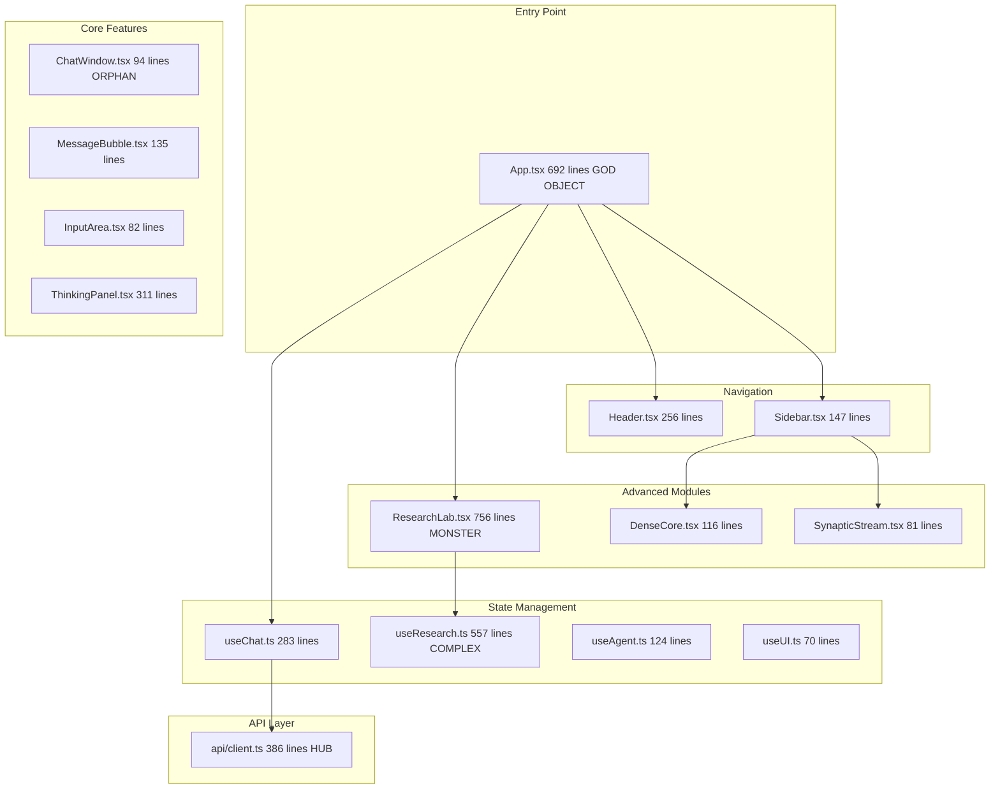

# 🔥 TOTAL CRITIC AUDIT: MAX UI/UX

**Дата:** 2025-12-15
**Режим:** Тотальный Аудит и Стратегическое Планирование
**Scope:** Все UI компоненты и хуки фронтенда

---

# 🗺️ ЧАСТЬ 1: КАРТА ПРОЕКТА (THE ARTIFACT)

## Архитектура фронтенда



## 🔴 Слепые зоны и Зоны риска

| Зона | Тип | Описание |
|------|-----|----------|
| `ChatWindow.tsx` | 🟡 Orphan | Создан но не используется в App.tsx — код дублирован |
| `App.tsx` 692 строки | 🔴 God Object | Содержит логику всех 6 табов, 15+ handlers |
| `ResearchLab.tsx` 756 строк | 🔴 Monster | 21 функция, 9 inline sub-components |
| `useResearch.ts` 557 строк | 🔴 Complex | WebSocket + REST + localStorage + Queue |
| `api/client.ts` 386 строк | 🟡 Hub | Все зависят — требует централизованной обработки ошибок |
| Skeleton.tsx | 🟢 Unused | Создан, но не интегрирован |

---

# 🩸 ЧАСТЬ 2: ЖЕСТКАЯ КРИТИКА (THE ROAST)

## 2.1 App.tsx — THE GOD OBJECT

### 🔴 Critical

1. **Monolithic Structure** — 692 строки, 15 handlers, 6 табов в одном файле
2. **Prop Drilling Hell** — UI hooks пробрасываются через 3-4 уровня
3. **No Error Boundary** — Один упавший компонент обрушит всё
4. **Memory Pattern** — ChatWindow.tsx создан но не используется

### 📉 Lazy UX

1. **Tab Buttons без Badge** — Нет индикатора активности в других табах
2. **No Keyboard Navigation** — Нет `Ctrl+1/2/3` shortcuts
3. **Agent Tab мёртв** — Нет кнопки "Stop" в UI

### 🧠 Logic Flaw

1. **`handleRegenerate` Race** — `setTimeout(0)` хрупко
2. **`loadInitialData` Promise.all** — Одна ошибка обрушит load
3. **Feedback не persistence** — `feedbackSent` теряется при reload

---

## 2.2 ResearchLab.tsx — THE MONSTER

### 🔴 Critical

1. **756 строк / 21 функция** — Невозможно поддерживать
2. **9 inline components** — Должны быть в отдельных файлах
3. **No Virtualization** — При 100+ topics будет лагать
4. **WebSocket Reconnect Flood** — Нет exponential backoff

### 📉 Lazy UX

1. **Topic Cards не sortable** — Нет сортировки
2. **No Search** — Невозможно найти topic
3. **QueuePanel не drag-drop** — Нельзя изменить приоритет
4. **SkillModal бедный** — Только текст

---

## 2.3 useChat.ts — THE BRAIN

### 🔴 Critical

1. **No Retry Logic** — Network error = dead
2. **Token Counter Bug:**

```typescript
setTokensPerSecond(prev => {
    const newCount = prev + 1;  // BUG: prev это rate, не count!
    return Math.round(newCount / elapsed);
});
```

### 📉 Lazy UX

1. **No Draft Persistence** — Input теряется при tab switch
2. **No Message Edit** — Нельзя редактировать сообщение

---

## 2.4 Header.tsx — OVERLOADED

### 🔴 Critical

1. **18 props!** — Code smell
2. **backupStatus не реализован**

### 📉 Lazy UX

1. **Search мёртв** — Input есть, но не фильтрует
2. **Dark Mode не работает**

---

## 2.5 api/client.ts — THE HUB

### 🔴 Critical

1. **No Retry on 5xx**
2. **No Request Deduplication**
3. **API_BASE Hardcoded** — Нет env variable
4. **streamChat early return bug:**

```typescript
if (data._meta) {
    return;  // BUG: выход из цикла, не из функции!
}
```

---

# 🚀 ЧАСТЬ 3: МУЛЬТИВЕРС РЕШЕНИЙ

## 1. App.tsx Decomposition

**Проблема:** 692 строки God Object

| Путь | Решение |
|------|---------|
| 🛣️ **A (Quick)** | Вынести табы: `ChatTab.tsx`, `RagTab.tsx`, `AgentTab.tsx` |
| 🛣️ **Б (Enterprise)** | React Router + Lazy loading |
| 🛣️ **В (Visionary)** | Micro-frontends с module federation |

## 2. ResearchLab Modularization

**Проблема:** 756 строк, 21 функция

| Путь | Решение |
|------|---------|
| 🛣️ **A** | Вынести в `research/` folder |
| 🛣️ **Б** | react-window virtualization |
| 🛣️ **В** | 3D Knowledge Graph (Three.js) |

## 3. Error Handling

**Проблема:** Нет retry, нет error boundaries

| Путь | Решение |
|------|---------|
| 🛣️ **A** | ErrorBoundary + try/catch |
| 🛣️ **Б** | react-query с retry/cache |
| 🛣️ **В** | Circuit Breaker pattern |

## 4. Interactivity

**Проблема:** Search не работает, нет shortcuts

| Путь | Решение |
|------|---------|
| 🛣️ **A** | Cmd+K command palette |
| 🛣️ **Б** | Full-text search + filters |
| 🛣️ **В** | Voice UI + gestures |

---

# 🔮 ЧАСТЬ 4: ИНСАЙДЫ И ИТОГ

## Executive Summary

| Метрика | Оценка |
|---------|--------|
| **Code Quality** | 5/10 |
| **UX Maturity** | 4/10 |
| **Resilience** | 3/10 |
| **Visual Design** | 8/10 |

## 🚨 TRIAGE Plan

### Неделя 1: Critical

1. ✅ Wrap App in ErrorBoundary
2. ✅ Fix tokensPerSecond bug
3. ✅ Fix streamChat return bug
4. ✅ Add WebSocket backoff

### Неделя 2: Decomposition

1. Extract 6 tabs into files
2. Extract ResearchLab components
3. Add react-query

### Неделя 3: Interactivity

1. Cmd+K command palette
2. Keyboard shortcuts
3. Clickable DenseCore

## Verdict

> **"Отличный визуальный дизайн, но 'спагетти первой версии'. Для продакшена требуется 2-3 недели реструктуризации. Главный враг — God Objects."**

---

# 📋 ЧАСТЬ 5: ПЛАН ИСПРАВЛЕНИЙ (IMPLEMENTATION CHECKLIST)

## 🔴 P0: КРИТИЧЕСКИЕ БАГИ (Неделя 1)

### api/client.ts

- [ ] **FIX-001**: Исправить `streamChat` early return bug (line 185 `return` → `continue`)
- [ ] **FIX-002**: Добавить env variable для `API_BASE` (`import.meta.env.VITE_API_URL`)
- [ ] **FIX-003**: Добавить retry logic для 5xx ошибок (3 попытки с exponential backoff)
- [ ] **FIX-004**: Добавить request timeout (30s default)

### useChat.ts

- [ ] **FIX-005**: Исправить `tokensPerSecond` calculation bug:

  ```typescript
  // FIX: Использовать tokenCount state вместо prev
  const currentCount = tokenCount + 1;
  setTokenCount(currentCount);
  setTokensPerSecond(Math.round(currentCount / elapsed));
  ```

- [ ] **FIX-006**: Добавить retry при network error с "Retry" кнопкой
- [ ] **FIX-007**: Сохранять `thinkingSteps` history (не очищать при новом сообщении)

### useResearch.ts

- [ ] **FIX-008**: Добавить exponential backoff для WebSocket reconnect:

  ```typescript
  const delay = Math.min(30000, 1000 * Math.pow(2, reconnectAttempt));
  ```

- [ ] **FIX-009**: Добавить max reconnect attempts (10) с fallback на polling

### App.tsx

- [ ] **FIX-010**: Обернуть в `<ErrorBoundary>` с fallback UI
- [ ] **FIX-011**: Исправить `loadInitialData` — использовать `Promise.allSettled` вместо `Promise.all`
- [ ] **FIX-012**: Добавить кнопку "Stop Agent" в UI Agent Tab

---

## 🟡 P1: АРХИТЕКТУРА (Неделя 2)

### App.tsx Decomposition

- [ ] **ARCH-001**: Создать `src/components/tabs/` folder
- [ ] **ARCH-002**: Вынести Chat tab в `ChatTab.tsx` (~150 lines)
- [ ] **ARCH-003**: Вынести RAG tab в `RagTab.tsx` (~80 lines)
- [ ] **ARCH-004**: Вынести Agent tab в `AgentTab.tsx` (~100 lines)
- [ ] **ARCH-005**: Вынести Templates tab в `TemplatesTab.tsx` (~60 lines)
- [ ] **ARCH-006**: Вынести History tab в `HistoryTab.tsx` (~40 lines)
- [ ] **ARCH-007**: App.tsx остаётся layout (~200 lines max)

### ResearchLab.tsx Modularization

- [ ] **ARCH-008**: Создать `src/components/research/` folder
- [ ] **ARCH-009**: Вынести `QualityBar.tsx`
- [ ] **ARCH-010**: Вынести `StatsDashboard.tsx`
- [ ] **ARCH-011**: Вынести `TaskCard.tsx`
- [ ] **ARCH-012**: Вынести `TopicCard.tsx`
- [ ] **ARCH-013**: Вынести `ResearchQueuePanel.tsx`
- [ ] **ARCH-014**: Вынести `SkillModal.tsx`
- [ ] **ARCH-015**: Вынести `CelebrationModal.tsx`
- [ ] **ARCH-016**: ResearchLab.tsx остаётся orchestrator (~200 lines max)

### useResearch.ts Split

- [ ] **ARCH-017**: Создать `useResearchQueue.ts` (queue management)
- [ ] **ARCH-018**: Создать `useResearchWebSocket.ts` (WS connection)
- [ ] **ARCH-019**: useResearch.ts остаётся facade (~150 lines max)

### Удаление мёртвого кода

- [ ] **ARCH-020**: Удалить или интегрировать `ChatWindow.tsx` (orphan)
- [ ] **ARCH-021**: Интегрировать `Skeleton.tsx` в loading states

---

## 🟢 P2: UX УЛУЧШЕНИЯ (Неделя 3-4)

### Interactivity

- [ ] **UX-001**: Добавить keyboard shortcuts (`Ctrl+1` = Chat, `Ctrl+2` = RAG, etc.)
- [ ] **UX-002**: Добавить `Cmd+K` / `Ctrl+K` command palette (cmdk library)
- [ ] **UX-003**: Сделать DenseCore clickable → открывает metrics modal
- [ ] **UX-004**: Добавить Tab badges (unread count/activity indicator)

### Search & Filters

- [ ] **UX-005**: Реализовать Header search — фильтрация conversations
- [ ] **UX-006**: Добавить Topic search в ResearchLab
- [ ] **UX-007**: Добавить Topic sort (date/quality/name)
- [ ] **UX-008**: Добавить Topic filter by status (complete/in-progress)

### Drag & Drop

- [ ] **UX-009**: Queue reorder drag-drop (react-dnd или @dnd-kit)
- [ ] **UX-010**: Sidebar conversations reorder/pin

### Data Persistence

- [ ] **UX-011**: Сохранять `feedbackSent` в localStorage
- [ ] **UX-012**: Сохранять chat draft input при tab switch
- [ ] **UX-013**: Добавить message edit functionality

### Sidebar Improvements

- [ ] **UX-014**: Показывать все conversations (remove `.slice(0, 5)`)
- [ ] **UX-015**: Добавить delete conversation button
- [ ] **UX-016**: Добавить conversation search

### Header Cleanup

- [ ] **UX-017**: Удалить или реализовать `backupStatus` prop
- [ ] **UX-018**: Удалить или реализовать Dark Mode toggle
- [ ] **UX-019**: Reduce props: использовать context или object prop

### ThinkingPanel

- [ ] **UX-020**: Добавить collapsible steps (при >5 steps)
- [ ] **UX-021**: Добавить copy button для think content
- [ ] **UX-022**: Добавить gradient confidence (не только 3 уровня)

### InputArea Advanced

- [ ] **UX-023**: Добавить file attachment button
- [ ] **UX-024**: Добавить @mention для RAG documents
- [ ] **UX-025**: Добавить /slash commands support

---

## 📊 ПРОГРЕСС

| Категория | Всего | Сделано | % |
|-----------|-------|---------|---|
| P0 Critical | 12 | 0 | 0% |
| P1 Architecture | 21 | 0 | 0% |
| P2 UX | 25 | 0 | 0% |
| **TOTAL** | **58** | **0** | **0%** |

---

## 🧪 VERIFICATION PLAN

### После каждого batch

1. **TypeScript Check**: `cd frontend && npx tsc --noEmit`
2. **Lint Check**: `npm run lint`
3. **Dev Server**: `npm run dev` — проверить в браузере
4. **Unit Tests**: `npm test` (если есть)

### Manual Testing Checklist

- [ ] Chat tab: отправить сообщение, проверить streaming
- [ ] RAG tab: загрузить документ, удалить
- [ ] Research tab: запустить research, проверить progress
- [ ] Agent tab: запустить агента, остановить
- [ ] Templates tab: применить шаблон
- [ ] History tab: выбрать conversation
- [ ] Sidebar: переключение табов, свернуть/развернуть
- [ ] Mobile: проверить responsive layout

---

## 📅 TIMELINE

| Неделя | Focus | Ожидаемый результат |
|--------|-------|---------------------|
| 1 | P0 Critical | Все баги исправлены, app стабилен |
| 2 | P1 Architecture (Part 1) | App.tsx decomposed, 6 tab files |
| 3 | P1 Architecture (Part 2) | ResearchLab modularized |
| 4 | P2 UX | Keyboard nav, search, DnD |

**Estimated Total Effort:** ~80-100 часов разработки
