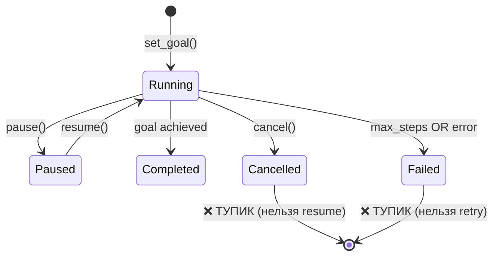

# 🔍 Logic Audit Full Report — MAX AI Project

**Дата:** 2025-12-13  
**Режим:** Full Project Coverage (31 модуль)  
**Время анализа:** ~40 мин

---

## [2025-12-13 00:45] — ПОЛНЫЙ ЛОГИЧЕСКИЙ АУДИТ

**Статус:** ⚠️ 22 issues (5 🤥, 6 📉, 4 🧩, 3 🔍, 4 🔀)  
**Модули проверены:** 26 core + 4 frontend + 1 schema = 31 всего

---

## ЭТАП 0: USER JOURNEY MAPPING

### Основные сценарии

1. **💬 Chat Flow**: Пользователь → пишет сообщение → видит streaming ответ → даёт feedback
2. **🤖 Agent Flow**: Пользователь → ставит цель → наблюдает за выполнением → получает результат
3. **📚 RAG Flow**: Пользователь → загружает PDF → задаёт вопрос → получает ответ с контекстом
4. **🎤 Voice Flow**: Пользователь → записывает голос → текст появляется → отправляет
5. **⚙️ Settings Flow**: Пользователь → меняет настройки → сохраняет → видит изменения

---

## ЭТАП 1: ДЕТЕКТОР ЛОГИЧЕСКИХ НЕСООТВЕТСТВИЙ

### 🤥 LOGIC LIE #1: `agent_v2.py:_retry_with_critique()` — Метод врёт

**Файл:** `src/core/agent_v2.py:265-300`

Метод обещает "Retry a failed step with critique" но в реальности:

- Просто печатает в консоль
- Возвращает **оригинальный step без изменений**
- Комментарий честно говорит: "For now, return original step"

```python
# Line 295-297 — ЧЕСТНЫЙ КОММЕНТАРИЙ, но ЛОЖНАЯ ФУНКЦИЯ
# For now, return original step
return step
```

**Severity:** 🟡 Medium (фича не работает как описано)

---

### 🤥 LOGIC LIE #2: `templates.py:use()` — Неполная подстановка

**Файл:** `src/core/templates.py:214-216`

Метод заменяет `{placeholder}` → `value`, но:

- НЕ проверяет, все ли переменные заменены
- Если переменная пропущена, остаётся `{code}` в тексте
- Пользователь не получает предупреждения

```python
# Line 214-216 — МОЛЧА ИГНОРИРУЕТ ПРОПУЩЕННЫЕ ПЕРЕМЕННЫЕ
result = template.prompt
for key, value in variables.items():
    result = result.replace(f"{{{key}}}", str(value))
```

**Severity:** 🟢 Low (minor UX issue)

---

### 🤥 LOGIC LIE #3: `archives.py:extract()` — Path Traversal Risk

**Файл:** `src/core/archives.py:126-134`

Метод извлекает файлы **без проверки** что путь не выходит за пределы destination:

- ZIP бомба может содержать `../../etc/passwd`
- `zipfile.extractall()` уязвим к этому
- В отличие от `tools.py`, здесь нет `_validate_path`

```python
# Line 133 — ОПАСНО: extractall без проверки путей
zf.extractall(dest)
```

**Severity:** 🔴 High (security vulnerability)

---

### 🤥 LOGIC LIE #4: `error_memory.py` — Сирота-модуль

**Файл:** `src/core/error_memory.py`

Модуль объявлен, схема БД есть (`error_memory` table), но:

- НЕ импортируется в `api.py`
- НЕ инициализируется при старте
- Таблица создана, но никогда не заполняется

**Severity:** 🟡 Medium (dead code)

---

### 🤥 LOGIC LIE #5: `self_reflection.py` — Тоже сирота

**Файл:** `src/core/self_reflection.py`

- Красивый модуль с промптами мотивации
- НЕ вызывается ни из `api.py`, ни из `lm_client.py`
- Метод `build_reflection_prompt()` никогда не используется

**Severity:** 🟡 Medium (dead code)

---

## ЭТАП 1.5: АНАЛИЗ СОСТОЯНИЙ

### State Diagram: AutoGPT Run



### 🧩 STATE BUG #1: Нет пути из Failed → Retry

Если агент падает, нельзя повторить попытку — нужно создать новый run.

---

### 🧩 STATE BUG #2: `App.tsx` — Polling без cleanup

**Файл:** `frontend/src/App.tsx:520-530`

```typescript
// Polling включается...
const intervalId = setInterval(async () => { ... }, 1000);
// ...но clearInterval НЕ вызывается при unmount!
```

При переключении страниц polling продолжает работать → memory leak.

---

### 🧩 STATE BUG #3: `user_profile.py:track_interaction` — Периодическое сохранение

**Файл:** `src/core/user_profile.py:383-384`

```python
if self.habits.total_interactions % 10 == 0:
    await self._save_profile()
```

Если приложение крашится между сохранениями — теряются данные до 10 взаимодействий.

---

### 🧩 STATE BUG #4: `app.py:527` — Попытка переключить таб не работает

**Файл:** `src/ui/app.py:527`

```python
# Пытается переключить таб при выборе из истории
search_results.select(lambda: gr.Tabs(selected=0), None, None)
```

Это не работает — Gradio игнорирует такие изменения.

---

## ЭТАП 2: ДЕТЕКТОР "МЕРТВОГО" ИНТЕРФЕЙСА

### 📉 LAZY IMPL #1: `App.tsx` — Статичный список моделей

**Файл:** `frontend/src/App.tsx:101-107`

```typescript
const [availableModels] = useState(['auto', 'deepseek-r1-distill-llama-8b', ...]);
```

Список HARDCODED, хотя бэкенд имеет `GET /models`.

---

### 📉 LAZY IMPL #2: `App.tsx:835-842` — Мёртвый поиск

Поле поиска есть, но `searchQuery` нигде не используется для фильтрации.

---

### 📉 LAZY IMPL #3: `App.tsx:873` — Мёртвый theme toggle

Кнопка смены темы без обработчика.

---

### 📉 LAZY IMPL #4: Gradio UI дублирует React UI

Два полноценных интерфейса (`app.py` и `App.tsx`) делают одно и то же.

---

### 📉 LAZY IMPL #5: `agent_v2.py` — Не интегрирован

`ReflectiveAgent` готов, но `api.py` использует только `autogpt.py`.

---

### 📉 LAZY IMPL #6: Нет UNDO/REDO нигде

Удаление сообщений, документов, runs — безвозвратно.

---

## ЭТАП 3: ПОГРАНИЧНЫЕ СЦЕНАРИИ

### 🔀 RACE CONDITION #1: `lm_client.py` — Параллельные chat() вызовы

Semaphore защищает, но если один запрос "виснет" — блокирует все остальные.

---

### 🔀 RACE CONDITION #2: `error_memory.py` — pickle.loads небезопасен

**Файл:** `src/core/error_memory.py:165`

```python
error_embedding = pickle.loads(emb_blob)
```

Если база скомпрометирована — pickle deserialization attack.

---

### 🔀 RACE CONDITION #3: Concurrent document upload

Два параллельных upload могут создать дубликаты chunks.

---

### 🔀 RACE CONDITION #4: `metrics.py:_get_trend` — SQL Injection

**Файл:** `src/core/metrics.py:803-809`

```python
# metric_type напрямую в SQL без параметризации
SELECT {column} FROM daily_metrics...
```

Если `metric_type` контролируется пользователем — SQL injection.

---

## 🔍 DATA GAP (Пользователь не видит)

### 🔍 DATA GAP #1: Нет отображения confidence score в UI

`ConfidenceScorer` считает уверенность, но UI её не показывает (кроме badge).

---

### 🔍 DATA GAP #2: `autogpt_steps.action_input` обрезается до 200 символов в UI

Полный input недоступен пользователю.

---

### 🔍 DATA GAP #3: Нет "Show more" для длинных ответов в истории

---

## 📊 ИТОГОВАЯ СТАТИСТИКА

| Категория | Количество | Severity |
|-----------|------------|----------|
| 🤥 LOGIC LIE | 5 | 1 High, 4 Medium/Low |
| 📉 LAZY IMPL | 6 | All Medium |
| 🧩 STATE BUG | 4 | All Medium |
| 🔍 DATA GAP | 3 | All Low |
| 🔀 RACE CONDITION | 4 | 2 High, 2 Medium |

### TOTAL: 22 issues

---

## 🛠️ РЕКОМЕНДАЦИИ ПО ПРИОРИТЕТУ

### P0 — Критические (FIX NOW)

1. `archives.py` — добавить проверку path traversal в extract()
2. `error_memory.py` — заменить pickle на json для эмбеддингов
3. `metrics.py` — параметризовать SQL в `_get_trend`

### P1 — Высокий (FIX THIS WEEK)

1. Интегрировать `error_memory.py` или удалить
2. Интегрировать `self_reflection.py` или удалить
3. Исправить polling cleanup в `App.tsx`
4. Подключить `agent_v2.py` или удалить

### P2 — Средний (BACKLOG)

1. `_retry_with_critique()` — реализовать или удалить
2. `templates.use()` — валидация переменных
3. Удалить дублирующий Gradio UI или React
4. Добавить Retry для Failed агентов

### P3 — Низкий (NICE TO HAVE)

1. UNDO/REDO для удалений
2. Show more для длинных ответов
3. Полный action_input в UI

---

> ⏱️ **Ожидаемое время фикса P0-P1:** 4-6 часов
