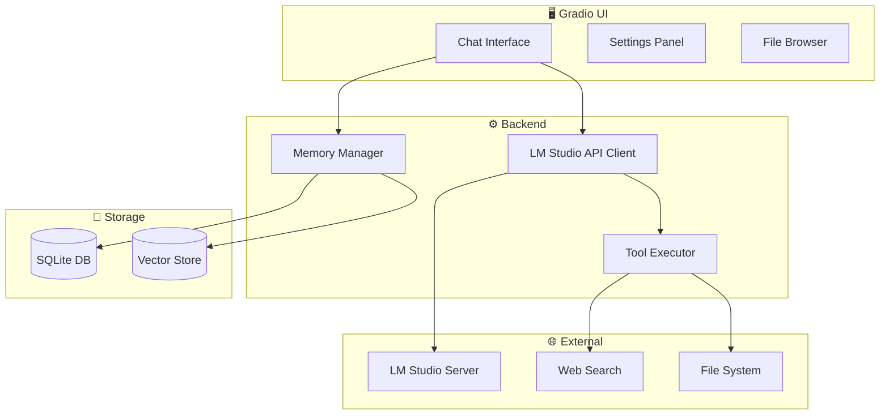
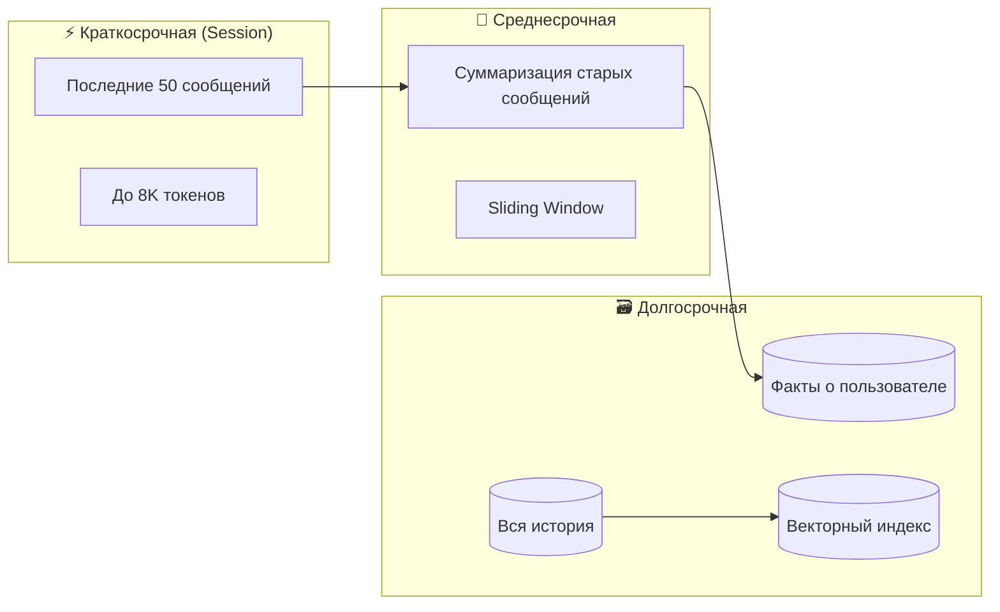

# MAX AI Assistant — Локальный ИИ-ассистент с LM Studio

Полнофункциональный чат-интерфейс для работы с локальными LLM через LM Studio. Ассистент обладает долговременной памятью, умеет выполнять команды с файлами, искать в интернете, и "думать" достаточно долго для качественных ответов.

---

## User Review Required

> [!IMPORTANT]
> **Выбор UI фреймворка**: Предлагаю использовать **Gradio** — он прост в развертывании, имеет встроенный чат-компонент, и отлично работает с Python backend. Альтернатива: Streamlit или веб-приложение на FastAPI + React.

> [!WARNING]
> **Доступ к файловой системе**: Ассистент сможет читать/писать файлы по вашим командам. Будет реализована "песочница" с подтверждением опасных операций (удаление, перемещение).

> [!CAUTION]
> **Веб-поиск**: Требует API ключ для DuckDuckGo/SearXNG или прокси. Можно использовать бесплатный `duckduckgo_search` Python пакет.

---

## Архитектура системы



---

## Proposed Changes

### Core Module (`src/core/`)

#### [NEW] [lm_client.py](file:///c:/Users/Vitaliy/Desktop/MAX/src/core/lm_client.py)

**LM Studio API клиент**

- OpenAI-совместимый клиент для `http://localhost:1234/v1`
- Поддержка streaming для плавного вывода текста
- Настраиваемые параметры: `temperature`, `max_tokens`, `top_p`
- **Thinking time**: параметр `min_thinking_time` — ждать минимум N секунд перед отправкой (для "глубокого размышления")
- Tool-calling через `/v1/responses` endpoint

```python
class LMStudioClient:
    async def chat(self, messages: list, stream: bool = True, tools: list = None)
    async def list_models(self) -> list[str]
    def set_thinking_time(self, seconds: int)
```

---

#### [NEW] [memory.py](file:///c:/Users/Vitaliy/Desktop/MAX/src/core/memory.py)

**Система долговременной памяти + 🆕 Длинные диалоги**

- SQLite для хранения истории разговоров
- Semantic search через embeddings (LM Studio `/v1/embeddings`)
- Автоматическое извлечение ключевых фактов из диалога
- 🆕 **Smart Context Window**: автосуммаризация старых сообщений
- 🆕 **Sliding Window**: последние N сообщений полностью + сжатая история
- 🆕 **Token Counter**: контроль размера контекста через `tiktoken`

```python
class MemoryManager:
    def add_message(self, role: str, content: str, conversation_id: str)
    def get_smart_context(self, max_tokens: int = 8000) -> list  # NEW
    def compress_history(self, conversation_id: str) -> str  # NEW
    def search_memory(self, query: str) -> list[Message]
```

---

#### [NEW] [tools.py](file:///c:/Users/Vitaliy/Desktop/MAX/src/core/tools.py)

**Инструменты ассистента**

| Инструмент | Описание |
|------------|----------|
| `read_file` | Читает содержимое файла |
| `write_file` | Записывает текст в файл |
| `list_directory` | Показывает содержимое папки |
| `move_file` | Перемещает файл/папку |
| `delete_file` | Удаляет файл (с подтверждением) |
| `analyze_image` | Описывает изображение (через vision API) |
| `run_command` | Выполняет shell-команду (с подтверждением) |
| `web_search` | Поиск в интернете |
| `open_url` | Читает содержимое веб-страницы |
| 🆕 `extract_archive` | Распаковывает ZIP/RAR архивы |
| 🆕 `create_archive` | Создает ZIP архив из файлов |
| 🆕 `list_archive` | Показывает содержимое архива без распаковки |

```python
TOOLS = [
    {
        "type": "function",
        "function": {
            "name": "read_file",
            "description": "Read contents of a file",
            "parameters": {
                "type": "object",
                "properties": {
                    "path": {"type": "string", "description": "Absolute file path"}
                },
                "required": ["path"]
            }
        }
    },
    # ... остальные инструменты
]

class ToolExecutor:
    def execute(self, tool_name: str, arguments: dict) -> str
    def requires_confirmation(self, tool_name: str) -> bool
```

---

#### [NEW] [web_search.py](file:///c:/Users/Vitaliy/Desktop/MAX/src/core/web_search.py)

**Веб-поиск и чтение страниц**

- DuckDuckGo Search (бесплатно, без API ключа)
- Извлечение текста из HTML (BeautifulSoup)
- Кэширование результатов

```python
class WebSearcher:
    def search(self, query: str, max_results: int = 5) -> list[SearchResult]
    def read_page(self, url: str) -> str
```

---

#### [NEW] [archives.py](file:///c:/Users/Vitaliy/Desktop/MAX/src/core/archives.py)

**🆕 Работа с архивами**

- ZIP: встроенная поддержка Python (`zipfile`)
- RAR: через `rarfile` + UnRAR.exe
- Листинг, распаковка, создание архивов

```python
class ArchiveManager:
    def extract(self, archive_path: str, dest: str = None) -> list[str]
    def create_zip(self, files: list[str], output: str) -> str
    def list_contents(self, archive_path: str) -> list[ArchiveEntry]
```

---

#### [NEW] [rag.py](file:///c:/Users/Vitaliy/Desktop/MAX/src/core/rag.py)

**🆕 RAG — Retrieval-Augmented Generation**

- Загрузка документов: PDF, DOCX, TXT, MD
- Чанкинг текста с перекрытием (overlap)
- Векторный индекс через embeddings
- Semantic search по документам

```python
class RAGEngine:
    def add_document(self, file_path: str) -> int  # returns chunk count
    def query(self, question: str, top_k: int = 5) -> list[Chunk]
    def list_documents(self) -> list[Document]
    def remove_document(self, doc_id: str)
```

---

#### [NEW] [autogpt.py](file:///c:/Users/Vitaliy/Desktop/MAX/src/core/autogpt.py)

**🆕 Auto-GPT режим — автономное выполнение задач**

- Разбиение цели на подзадачи
- Цикл: Plan → Execute → Review → Iterate
- Лимит шагов для безопасности
- Логирование каждого шага
- Пауза для подтверждения критических действий

```python
class AutoGPTAgent:
    def set_goal(self, goal: str)
    async def run(self, max_steps: int = 20) -> list[Step]
    def pause(self)  # user can pause/resume
    def get_plan(self) -> list[Task]
```

---

#### [NEW] [user_profile.py](file:///c:/Users/Vitaliy/Desktop/MAX/src/core/user_profile.py)

**🆕 Персонализация — адаптивная система под пользователя**

- База привычек: частые запросы, предпочитаемые форматы ответов
- Стиль общения: краткость/детализация, формальность, юмор
- Обучение на фидбэке: негативная реакция → избегать в будущем
- Определение настроения по тону сообщений
- Мягкая антиципация без навязчивости

```python
class UserProfile:
    def update_preference(self, key: str, value: Any)
    def get_style_prompt(self) -> str  # Добавляется в system prompt
    def record_feedback(self, message_id: str, positive: bool)
    def detect_mood(self, text: str) -> str  # happy, neutral, frustrated
    def get_suggestions(self, context: str) -> list[str]  # мягкие подсказки
```

---

### UI Module (`src/ui/`)

#### [NEW] [app.py](file:///c:/Users/Vitaliy/Desktop/MAX/src/ui/app.py)

**Главное Gradio приложение**

Интерфейс включает:

1. **Чат-панель** — основной интерфейс общения
2. **История разговоров** — список прошлых сессий
3. **Настройки** — temperature, max_tokens, thinking time
4. **Файловый браузер** — навигация по файловой системе
5. **Индикатор статуса** — "думает", "выполняет команду", "ищет в интернете"
6. 🆕 **RAG панель** — загрузка и управление документами
7. 🆕 **Auto-GPT панель** — запуск автономных задач, прогресс, лог шагов

---

### Database (`data/`)

#### [NEW] [schema.sql](file:///c:/Users/Vitaliy/Desktop/MAX/data/schema.sql)

```sql
CREATE TABLE conversations (
    id TEXT PRIMARY KEY,
    title TEXT,
    created_at TIMESTAMP DEFAULT CURRENT_TIMESTAMP,
    updated_at TIMESTAMP
);

CREATE TABLE messages (
    id INTEGER PRIMARY KEY AUTOINCREMENT,
    conversation_id TEXT REFERENCES conversations(id),
    role TEXT NOT NULL, -- 'user', 'assistant', 'system', 'tool'
    content TEXT NOT NULL,
    tool_calls TEXT, -- JSON
    created_at TIMESTAMP DEFAULT CURRENT_TIMESTAMP
);

CREATE TABLE memory_facts (
    id INTEGER PRIMARY KEY AUTOINCREMENT,
    content TEXT NOT NULL,
    embedding BLOB,
    source_message_id INTEGER REFERENCES messages(id),
    created_at TIMESTAMP DEFAULT CURRENT_TIMESTAMP
);

-- RAG Documents
CREATE TABLE documents (
    id TEXT PRIMARY KEY,
    filename TEXT NOT NULL,
    file_path TEXT,
    chunk_count INTEGER,
    created_at TIMESTAMP DEFAULT CURRENT_TIMESTAMP
);

CREATE TABLE document_chunks (
    id INTEGER PRIMARY KEY AUTOINCREMENT,
    document_id TEXT REFERENCES documents(id),
    content TEXT NOT NULL,
    embedding BLOB,
    chunk_index INTEGER
);

-- Auto-GPT Tasks
CREATE TABLE autogpt_runs (
    id TEXT PRIMARY KEY,
    goal TEXT NOT NULL,
    status TEXT DEFAULT 'running', -- running, paused, completed, failed
    created_at TIMESTAMP DEFAULT CURRENT_TIMESTAMP
);

CREATE TABLE autogpt_steps (
    id INTEGER PRIMARY KEY AUTOINCREMENT,
    run_id TEXT REFERENCES autogpt_runs(id),
    step_number INTEGER,
    action TEXT,
    result TEXT,
    created_at TIMESTAMP DEFAULT CURRENT_TIMESTAMP
);
```

---

### Project Setup

#### [NEW] [requirements.txt](file:///c:/Users/Vitaliy/Desktop/MAX/requirements.txt)

```
openai>=1.0.0
gradio>=4.0.0
duckduckgo-search>=4.0.0
beautifulsoup4>=4.12.0
aiohttp>=3.9.0
aiosqlite>=0.19.0
pillow>=10.0.0
httpx>=0.25.0
numpy>=1.24.0
# 🆕 New dependencies
rarfile>=4.1           # RAR archives
pymupdf>=1.23.0        # PDF parsing for RAG
python-docx>=1.0.0     # DOCX parsing for RAG
tiktoken>=0.5.0        # Token counting for long context
```

#### [NEW] [run.py](file:///c:/Users/Vitaliy/Desktop/MAX/run.py)

Точка входа для запуска приложения.

---

## "Low Hanging Fruits" — Бонусные фичи (малой ценой)

| Фича | Сложность | Описание |
|------|-----------|----------|
| 🎨 **Темная тема** | Low | Gradio поддерживает из коробки |
| 📎 **Drag & Drop файлов** | Low | Перетаскивание файлов в чат |
| 🔊 **Голосовой ввод** | Medium | Whisper через LM Studio (если модель загружена) |
| 📊 **Статистика токенов** | Low | Показывать использование токенов в сессии |
| ⭐ **Избранные сообщения** | Low | Сохранять полезные ответы |
| 🔄 **Retry/Regenerate** | Low | Перегенерация последнего ответа |

---

## Verification Plan

### Automated Tests

```bash
# Тест подключения к LM Studio
python -m pytest tests/test_lm_client.py -v

# Тест системы памяти
python -m pytest tests/test_memory.py -v

# Тест инструментов
python -m pytest tests/test_tools.py -v
```

### Manual Verification

1. **Запуск UI:**

   ```bash
   cd c:\Users\Vitaliy\Desktop\MAX
   python run.py
   ```

   Откроется браузер на `http://localhost:7860`

2. **Тест чата:**
   - Написать "Привет, запомни что меня зовут Виталий"
   - Начать новый разговор
   - Спросить "Как меня зовут?" — должен вспомнить

3. **Тест файловых операций:**
   - "Покажи файлы в папке Desktop"
   - "Создай файл test.txt с текстом 'Hello World'"
   - "Прочитай файл test.txt"

4. **Тест веб-поиска:**
   - "Найди в интернете последние новости о SpaceX"

5. **Тест работы с изображениями:**
   - "Посмотри фото в папке X и опиши их"

---

## Структура проекта

```
MAX/
├── run.py                 # Точка входа
├── requirements.txt       # Зависимости
├── src/
│   ├── __init__.py
│   ├── core/
│   │   ├── __init__.py
│   │   ├── lm_client.py   # LM Studio API
│   │   ├── memory.py      # Память + long context
│   │   ├── tools.py       # Инструменты
│   │   ├── web_search.py  # Веб-поиск
│   │   ├── archives.py    # 🆕 ZIP/RAR
│   │   ├── rag.py         # 🆕 RAG документы
│   │   └── autogpt.py     # 🆕 Auto-GPT агент
│   └── ui/
│       ├── __init__.py
│       └── app.py         # Gradio UI
├── data/
│   ├── schema.sql         # Схема БД
│   └── max.db             # SQLite база (создается автоматически)
└── tests/
    ├── test_lm_client.py
    ├── test_memory.py
    └── test_tools.py
```

---

## 💡 Меню возможностей (будущее развитие)

1. **💡 Плагины** — система расширений для новых инструментов  
   *Почему круто:* пользователи могут добавлять свои команды  
   *Сложность:* Medium

2. **💡 Мультимодальность** — анализ аудио и видео  
   *Почему круто:* полная работа с медиа  
   *Сложность:* High (требует специальных моделей)

3. **💡 Голосовой ввод** — Whisper через LM Studio  
   *Почему круто:* говоришь — ассистент понимает  
   *Сложность:* Medium

---

## ✅ УТВЕРЖДЁННЫЕ ФИЧИ (MVP)

> [!NOTE]
> Эти фичи будут реализованы в первой версии по запросу пользователя.

### Управление моделями

| Фича | Описание |
|------|----------|
| ✅ **Model Switcher** | Переключение моделей через UI (CLI `lms load/unload`) |
| ✅ **Smart Routing** | Автовыбор модели: DeepSeek для reasoning, Pixtral для картинок |
| ✅ **Auto-Unload TTL** | Авто-выгрузка неиспользуемых моделей |

### Система памяти

| Фича | Описание |
|------|----------|
| ✅ **Session Memory** | Полная история текущего диалога (до лимита контекста) |
| ✅ **Summary Memory** | Автосуммаризация при превышении лимита токенов |
| ✅ **Facts Database** | Извлечение и хранение фактов о пользователе |
| ✅ **Cross-Session Memory** | Поиск по всем прошлым разговорам через embeddings |

### Режимы работы

| Фича | Описание |
|------|----------|
| ✅ **Reasoning Mode** | Режим "глубокого размышления" с chain-of-thought |
| ✅ **Quick Mode** | Быстрые ответы для простых вопросов |

### Продуктивность

| Фича | Описание |
|------|----------|
| ✅ **Templates/Prompts** | Сохранённые шаблоны промптов |
| ✅ **Search History** | Полнотекстовый поиск по истории |
| ✅ **Multi-language** | Автоопределение языка, перевод |

### 🆕 Персонализация (User Profile)

| Фича | Описание |
|------|----------|
| ✅ **Habits Database** | База привычек: что спрашиваете, как любите получать ответы |
| ✅ **Style Adaptation** | Краткость/детализация, формальность, юмор |
| ✅ **Feedback Learning** | Если недовольны → запоминает и не повторяет ошибок |
| ✅ **Mood Detection** | Определяет настроение и адаптирует тон |
| ✅ **Soft Anticipation** | Предвосхищает ожидания, но не навязывается |

---

## 🎯 Расширенный список фич (15 возможностей)

### Управление моделями

| # | Фича | Описание | Сложность |
|---|------|----------|-----------|
| 1 | **🔄 Model Switcher** | Переключение моделей через UI (CLI `lms load/unload`) | Low |
| 2 | **🧠 Smart Routing** | Автовыбор модели: DeepSeek для reasoning, Pixtral для картинок | Medium |
| 3 | **⏱️ Auto-Unload TTL** | Авто-выгрузка неиспользуемых моделей | Low |

### Память (Short-term + Long-term)

| # | Фича | Описание | Сложность |
|---|------|----------|-----------|
| 4 | **💬 Session Memory** | Полная история текущего диалога (до лимита контекста) | Low |
| 5 | **📝 Summary Memory** | Автосуммаризация при превышении лимита токенов | Medium |
| 6 | **🗃️ Facts Database** | Извлечение и хранение фактов ("меня зовут...", "мой проект...") | Medium |
| 7 | **🔗 Cross-Session Memory** | Поиск по всем прошлым разговорам через embeddings | Medium |

### Специфичные для моделей

| # | Фича | Описание | Сложность |
|---|------|----------|-----------|
| 8 | **🖼️ Vision Mode (Pixtral)** | Анализ изображений через Mistral Pixtral 12B | Medium |
| 9 | **🤔 Reasoning Mode (DeepSeek/Ministral)** | Режим "глубокого размышления" с chain-of-thought | Low |
| 10 | **⚡ Quick Mode** | Быстрые ответы для простых вопросов (меньше токенов) | Low |

### Продуктивность

| # | Фича | Описание | Сложность |
|---|------|----------|-----------|
| 11 | **📋 Templates/Prompts** | Сохранённые шаблоны промптов для частых задач | Low |
| 12 | **🔖 Bookmarks** | Избранные ответы для быстрого доступа | Low |
| 13 | **📤 Export** | Экспорт диалогов в Markdown/PDF | Low |
| 14 | **🔍 Search History** | Полнотекстовый поиск по всей истории | Medium |
| 15 | **🌐 Multi-language** | Автоопределение языка, перевод | Medium |

---

## 🧠 Архитектура памяти (подробно)



**Как работает:**

1. **Полчаса диалога?** Легко! Последние N сообщений хранятся полностью
2. При превышении лимита → старые сообщения суммаризируются
3. Ключевые факты извлекаются и сохраняются навсегда
4. Semantic search находит релевантный контекст из прошлых разговоров

---

> **Готов начать реализацию после вашего одобрения!**
